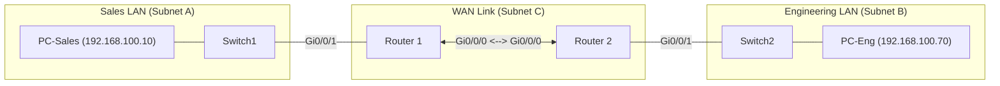

# Lab 09: Multi-Subnet IPv4 Routing & Design

## 🎯 Lab Objectives
1. Design an efficient subnetting scheme from `192.168.100.0/24` to support:
   * **Subnet A (Sales LAN)**: Minimum 50 usable host addresses.
   * **Subnet B (Engineering LAN)**: Minimum 25 usable host addresses.
   * **Subnet C (WAN Link between R1 and R2)**: Exactly 2 usable host addresses.
2. Configure IP addresses and descriptions on all router interfaces.
3. Configure static routes on R1 and R2 so that PCs in Sales and Engineering can ping each other.
4. Verify using `show ip route` and `show ip interface brief`.

---

## 🗺️ Topology Diagram



---

## 📋 Subnetting Design Sheet (Task 1)

| Subnet | Purpose | Subnet ID | Subnet Mask | Usable Range | Broadcast Address |
| :--- | :--- | :--- | :--- | :--- | :--- |
| **A** | Sales LAN (>=50 hosts) | `192.168.100.0` | `/26` (`255.255.255.192`) | `.1` - `.62` | `192.168.100.63` |
| **B** | Eng LAN (>=25 hosts) | `192.168.100.64` | `/27` (`255.255.255.224`) | `.65` - `.94` | `192.168.100.95` |
| **C** | R1-R2 Point-to-Point | `192.168.100.96` | `/30` (`255.255.255.252`) | `.97` - `.98` | `192.168.100.99` |

---

## 💻 Router Configuration Solution (Task 2 & 3)

### Router 1 (R1)
```cisco
hostname R1
!
interface GigabitEthernet0/0/0
 description Point-to-Point link to R2
 ip address 192.168.100.97 255.255.255.252
 no shutdown
!
interface GigabitEthernet0/0/1
 description Sales LAN Gateway
 ip address 192.168.100.1 255.255.255.192
 no shutdown
!
! Static route to Engineering LAN via R2 WAN IP
ip route 192.168.100.64 255.255.255.224 192.168.100.98
```

### Router 2 (R2)
```cisco
hostname R2
!
interface GigabitEthernet0/0/0
 description Point-to-Point link to R1
 ip address 192.168.100.98 255.255.255.252
 no shutdown
!
interface GigabitEthernet0/0/1
 description Engineering LAN Gateway
 ip address 192.168.100.65 255.255.255.224
 no shutdown
!
! Static route to Sales LAN via R1 WAN IP
ip route 192.168.100.0 255.255.255.192 192.168.100.97
```

---

## ✅ Verification Checklist
- [ ] `show ip interface brief` shows both interfaces as `up / up` on R1 and R2.
- [ ] `show ip route` shows connected (`C`), local (`L`), and static (`S`) routes.
- [ ] R1 can ping R2's WAN IP (`192.168.100.98`).
- [ ] PC-Sales can successfully ping PC-Eng across the routed topology.
