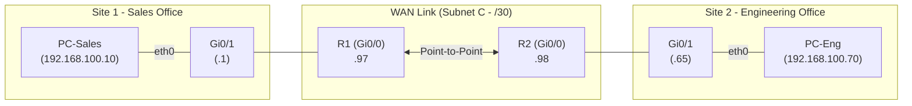

# Lab 09: Multi-Subnet IPv4 Routing & Design

<span class="badge badge-ccna">CCNA 200-301</span>
<span class="badge badge-time">Est. Time: 35 Mins</span>
<span class="badge badge-med">Difficulty: Intermediate</span>
<span class="badge badge-cml">CML Ready</span>

<div class="lab-header-card">
  <strong>Lab Overview & Objectives:</strong>
  <div class="lab-header-grid">
    <div><strong>Exam Objective:</strong> 1.6 IPv4 Subnetting & 3.1 Routing Table</div>
    <div><strong>Curriculum:</strong> Wendell Odom Vol 1, Chapter 9</div>
    <div><strong>Topology Nodes:</strong> 2x Cisco IOSv Routers, 2x Alpine PC Hosts</div>
    <div><strong>CML Lab ID:</strong> <code>86e5272c-f7a7-40b3-84ab-47ff9f969786</code></div>
  </div>
</div>

---

## 🏢 Business Scenario
Your organization has been allocated the single Class C block **`192.168.100.0/24`**. As the network engineer, you are tasked with designing an efficient Variable Length Subnet Masking (VLSM) scheme and implementing static routing between two office sites:

1. **Sales Department LAN (Site 1)**: Requires support for at least **50 usable host devices**.
2. **Engineering Department LAN (Site 2)**: Requires support for at least **25 usable host devices**.
3. **Point-to-Point WAN Link**: Connects Router 1 and Router 2, requiring exactly **2 usable host IP addresses**.

---

## 🗺️ Network Topology



---

## 📋 Task 1: VLSM Subnet Design Worksheet

Before configuring the routers, calculate the Subnet ID, Mask, Usable Range, and Broadcast Address for each segment from `192.168.100.0/24`.

??? tip "💡 Hint: Subnet Sizing Rules"
    * Always allocate from the **largest host requirement** down to the smallest:
      1. Sales LAN (>=50 hosts) $\rightarrow$ needs $2^6 - 2 = 62$ hosts $\rightarrow$ **/26**
      2. Engineering LAN (>=25 hosts) $\rightarrow$ needs $2^5 - 2 = 30$ hosts $\rightarrow$ **/27**
      3. Point-to-Point WAN (2 hosts) $\rightarrow$ needs $2^2 - 2 = 2$ hosts $\rightarrow$ **/30**

??? success "🔍 Solution: Completed Addressing Table"
    | Subnet Name | Purpose | Subnet ID | Subnet Mask | Prefix | Usable Host Range | Broadcast Address |
    | :--- | :--- | :--- | :--- | :--- | :--- | :--- |
    | **Subnet A** | Sales LAN | `192.168.100.0` | `255.255.255.192` | `/26` | `192.168.100.1` – `192.168.100.62` | `192.168.100.63` |
    | **Subnet B** | Engineering LAN | `192.168.100.64` | `255.255.255.224` | `/27` | `192.168.100.65` – `192.168.100.94` | `192.168.100.95` |
    | **Subnet C** | R1-R2 WAN | `192.168.100.96` | `255.255.255.252` | `/30` | `192.168.100.97` – `192.168.100.98` | `192.168.100.99` |

---

## 🛠️ Task 2: Router 1 (R1) Configuration

- [ ] Set hostname to `R1`.
- [ ] Configure `GigabitEthernet0/0` with the first usable IP of Subnet C (`192.168.100.97/30`).
- [ ] Configure `GigabitEthernet0/1` with the first usable IP of Subnet A (`192.168.100.1/26`).
- [ ] Add meaningful interface descriptions and enable both interfaces (`no shutdown`).
- [ ] Configure `logging synchronous` on console line.

??? tip "💡 Hint: R1 Configuration Syntax"
    ```cisco
    Router(config)# interface GigabitEthernet0/0
    Router(config-if)# ip address 192.168.100.97 255.255.255.252
    Router(config-if)# no shutdown
    ```

??? success "🔍 Solution: R1 Complete Configuration"
    ```cisco
    enable
    configure terminal
    hostname R1
    !
    interface GigabitEthernet0/0
     description WAN link to R2
     ip address 192.168.100.97 255.255.255.252
     no shutdown
    !
    interface GigabitEthernet0/1
     description Sales Department LAN Gateway
     ip address 192.168.100.1 255.255.255.192
     no shutdown
    !
    line con 0
     exec-timeout 0 0
     logging synchronous
    !
    end
    write memory
    ```

---

## 🛠️ Task 3: Router 2 (R2) Configuration

- [ ] Set hostname to `R2`.
- [ ] Configure `GigabitEthernet0/0` with the second usable IP of Subnet C (`192.168.100.98/30`).
- [ ] Configure `GigabitEthernet0/1` with the first usable IP of Subnet B (`192.168.100.65/27`).
- [ ] Add interface descriptions and enable both interfaces (`no shutdown`).
- [ ] Configure `logging synchronous` on console line.

??? success "🔍 Solution: R2 Complete Configuration"
    ```cisco
    enable
    configure terminal
    hostname R2
    !
    interface GigabitEthernet0/0
     description WAN link to R1
     ip address 192.168.100.98 255.255.255.252
     no shutdown
    !
    interface GigabitEthernet0/1
     description Engineering Department LAN Gateway
     ip address 192.168.100.65 255.255.255.224
     no shutdown
    !
    line con 0
     exec-timeout 0 0
     logging synchronous
    !
    end
    write memory
    ```

---

## 🛠️ Task 4: Static Route Configuration

- [ ] On **R1**, configure a static route to the Engineering LAN (`192.168.100.64/27`) via R2's WAN IP (`192.168.100.98`).
- [ ] On **R2**, configure a static route to the Sales LAN (`192.168.100.0/26`) via R1's WAN IP (`192.168.100.97`).

??? tip "💡 Hint: Static Route Command"
    `ip route <destination-network-id> <destination-mask> <next-hop-ip>`

??? success "🔍 Solution: Static Route Commands"
    **On Router 1 (R1):**
    ```cisco
    R1(config)# ip route 192.168.100.64 255.255.255.224 192.168.100.98
    ```

    **On Router 2 (R2):**
    ```cisco
    R2(config)# ip route 192.168.100.0 255.255.255.192 192.168.100.97
    ```

---

## 🖥️ Task 5: Endpoint (PC) IP & Gateway Setup

- [ ] On **PC-Sales**, assign IP `192.168.100.10/26` with default gateway `192.168.100.1`.
- [ ] On **PC-Eng**, assign IP `192.168.100.70/27` with default gateway `192.168.100.65`.

??? success "🔍 Solution: Alpine Linux Endpoint Commands"
    **On PC-Sales:**
    ```bash
    ip addr add 192.168.100.10/26 dev eth0
    ip link set eth0 up
    ip route add default via 192.168.100.1
    ```

    **On PC-Eng:**
    ```bash
    ip addr add 192.168.100.70/27 dev eth0
    ip link set eth0 up
    ip route add default via 192.168.100.65
    ```

---

## ✅ Comprehensive Verification Matrix

=== "1. Check Interface Status"
    Verify that all interfaces are `up/up` on R1:
    ```cisco
    R1# show ip interface brief
    Interface              IP-Address      OK? Method Status                Protocol
    GigabitEthernet0/0     192.168.100.97  YES manual up                    up      
    GigabitEthernet0/1     192.168.100.1   YES manual up                    up      
    ```

=== "2. Inspect Routing Table"
    Verify Connected (`C`), Local (`L`), and Static (`S`) routes on R1:
    ```cisco
    R1# show ip route
         192.168.100.0/24 is variably subnetted, 5 subnets, 4 masks
    C       192.168.100.0/26 is directly connected, GigabitEthernet0/1
    L       192.168.100.1/32 is directly connected, GigabitEthernet0/1
    S       192.168.100.64/27 [1/0] via 192.168.100.98
    C       192.168.100.96/30 is directly connected, GigabitEthernet0/0
    L       192.168.100.97/32 is directly connected, GigabitEthernet0/0
    ```

=== "3. End-to-End Ping Test"
    Execute ping from **PC-Sales** to **PC-Eng**:
    ```bash
    PC-Sales:~$ ping -c 4 192.168.100.70
    PING 192.168.100.70 (192.168.100.70): 56 data bytes
    64 bytes from 192.168.100.70: seq=0 ttl=62 time=3.12 ms
    64 bytes from 192.168.100.70: seq=1 ttl=62 time=2.45 ms
    64 bytes from 192.168.100.70: seq=2 ttl=62 time=2.18 ms
    64 bytes from 192.168.100.70: seq=3 ttl=62 time=2.29 ms

    --- 192.168.100.70 ping statistics ---
    4 packets transmitted, 4 packets received, 0% packet loss
    ```

---

## ⚡ Break-Fix Challenge: The Disappearing Packets

??? warning "⚠️ Break-Fix Challenge: Symptom"
    **Symptom**: PC-Sales can ping its default gateway (`192.168.100.1`) and can ping R2's WAN IP (`192.168.100.98`), but cannot ping `PC-Eng` (`192.168.100.70`).
    
    **Challenge**: What are the top 3 possible configuration errors causing this specific symptom?

??? success "🛠️ Solution & Diagnostic Breakdown"
    1. **Missing or incorrect return static route on R2**: R2 does not have a route back to `192.168.100.0/26`. ICMP echo requests reach PC-Eng, but echo replies are dropped by R2 because it has no route to the source!
    2. **Missing default gateway on PC-Eng**: PC-Eng receives the ping, but does not know to send the reply to its gateway `192.168.100.65`.
    3. **Subnet Mask mismatch on R1 static route**: R1 was configured with `/28` (`255.255.255.240`) instead of `/27` (`255.255.255.224`), excluding host `.70`.

---

## 📦 CML Lab Launch & Control

```bash
# Start the lab on your CML instance
~/ccna-study/scripts/cml_client.py start 86e5272c-f7a7-40b3-84ab-47ff9f969786

# Stop the lab when finished
~/ccna-study/scripts/cml_client.py stop 86e5272c-f7a7-40b3-84ab-47ff9f969786
```
